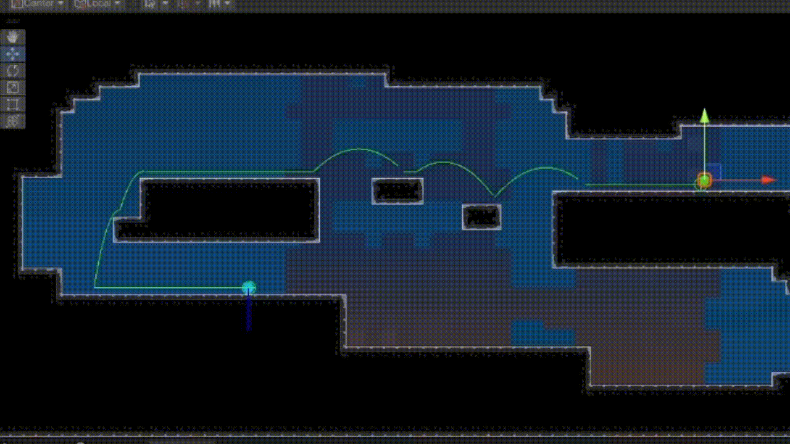
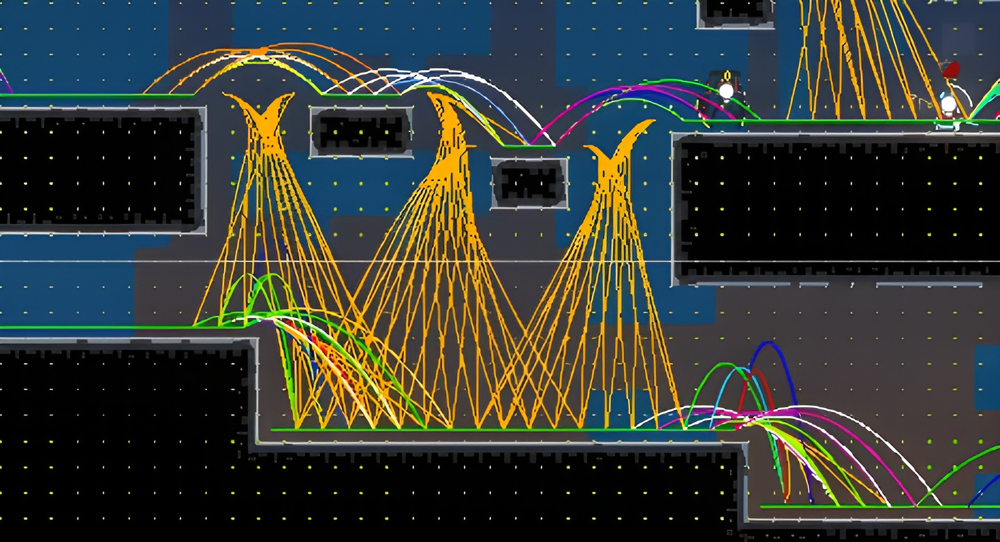
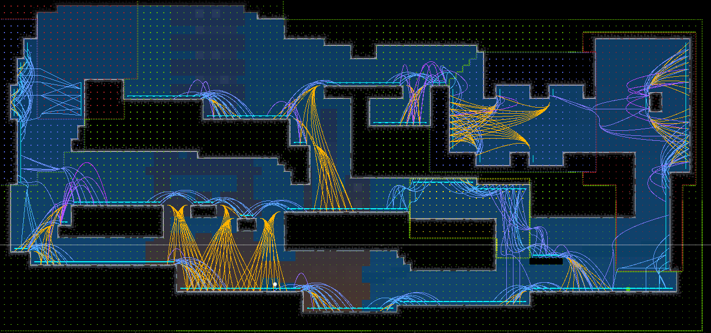

# Platform Pathfinding

It is easy to find a solution for pathfinding for a 2D surface, that can be used for 3D agents or 2D agents that give the impression of flying, but what about grounded 2D agents ?

This package provides a solution to allow an agent to explore a 2D set of platforms by baking all the possible transition intra and inter-platforms



## Prerequisites

The package does not handle dynamics colliders for now, only fixed tilemap colliders (other static colliders can easily be added)

The size of the agent must be known beforehand, some transitions might be impossible if the agents bumps his head in a platform when jumping.

The gravity field of the scene can be non uniform as long as it is fixed and we can access it's value for any position in the scene

## Baking the Pathfinding Graph

#### Creating the Graph
- The space is discretized into a grid, where every cell is categorized in one of the following values :
    ```cs
    public enum TileType
    {
        Walkable,
        Obstacle,
        Void,
        Empty,
    }
    ```
- Connections between tiles are created, first the walk connection, then the falling connections, and finally the jump connections. Collisions detections are made for each transition along the path to make sure the entity has enough space to make the jump.
    ```cs
    public enum EdgeType
    {
        Walk,
        Fall,
        Jump,
    }
    ```
- A lot of similar connections are created, we then filter the graph to only keep one connections possible between each platform : the most efficient one in terms of time and velocity

When the graph is created, list of debug positions are saved to debug trajectories, we can then visualize all the remaining connections :



The orange trajectories are the falling trajectories (no y-axis initial velocity)

The green trajectories are the walking connections

### Complex Gravity Scenarios

One specificity of the game for which this system was created is that the gravity is not constant

Here is an example in an area where the gravity changes, the entity can jump and change gravity mid-air. 



- The gravity area are displayed with color points (green = down, yellow = up, red = right, blue = left)

## Pathfinding Logic

The runtime pathfinding component uses the common A* algorithm to seek a path through the graph. 

For performance purposes the path is only updated when the entity or target changes tile. 

Here is the result for a complex path (multi gravity scenario)

